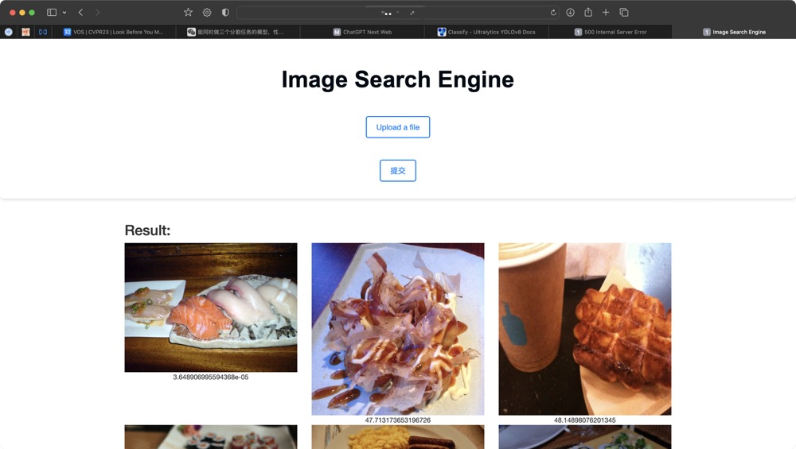

# Image Search Engine




## Overview

- `extractor.py`:使用在imagenet1k上预训练的resnet50来提取特征，将每张图片的特征保存为.npy文件用于kd树的构建
-  `build_kdtree.py`:构建kd树用于搜索
- `server.py`: 这段脚本运行一个网络服务器。可以通过 Flask 网络界面将图片返回到本地。本地通过kd树搜索最相似的图片展示到网页上
- GPUs are not required.

## Link

- `images`:链接: https://pan.baidu.com/s/1JCMsaoHiheSdz0Qwo4PFDw?pwd=3djh 提取码: 3djh 复制这段内容后打开百度网盘手机App，操作更方便哦
- `feature`:链接: https://pan.baidu.com/s/1Jyuta8VPqA-7-Pc55Eq0RQ?pwd=ayxi 提取码: ayxi

## Usage
```bash
cd SearchEngine
pip install -r requirements.txt
# 从链接下载images和feature将static中的文件夹替换为对应文件，文件结构如下
.
├── feature
│   ├── 000001.npy
│   └── 000002.npy
├── images
│   ├── 000001.jpg
│   └── 000002.jpg
└── uploaded
    └── 2023-11-23T15.11.33.659328_5437.jpg
python extractor.py#若下载了feature文件则不用运行
python build_kdtree.py#
python server.py
#访问localhost:5000即可进入搜索引擎
```

## TODOList

-  当前数据集只有食物数据，且类别比较少，需要扩充
-  特征提取模型为预训练模型，可以在新的数据集上训练
-  使用更高效的搜索算法
